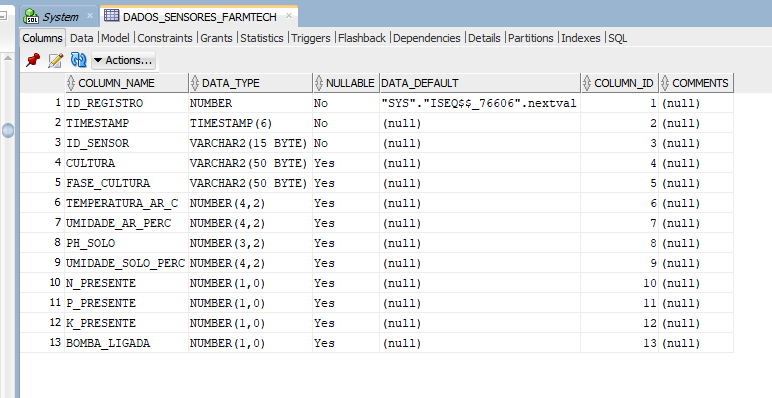
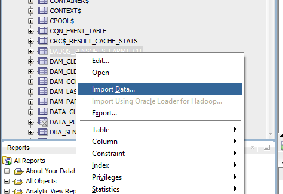
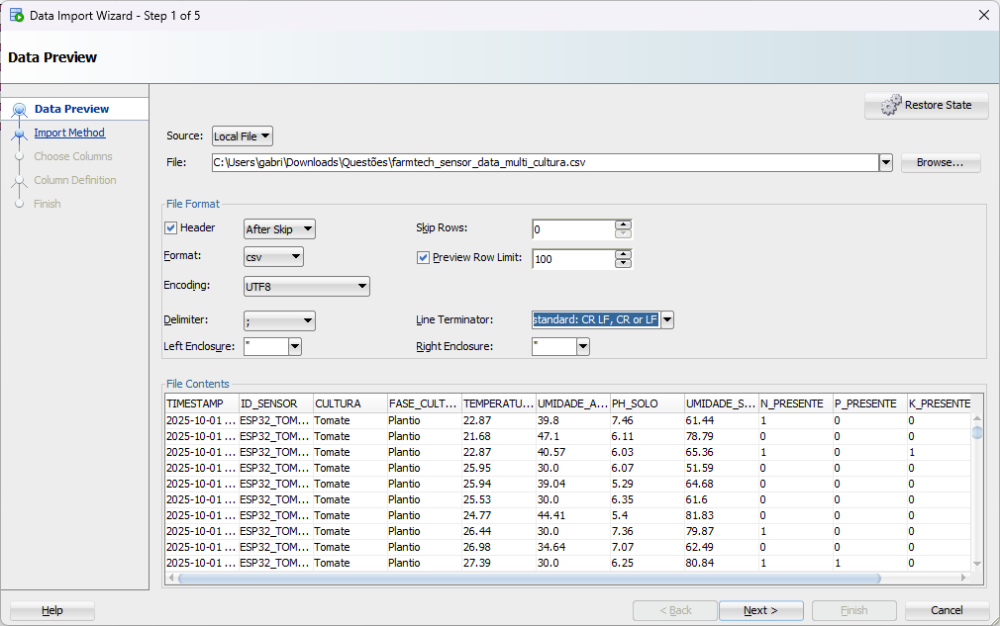

# FIAP - Faculdade de Informática e Administração Paulista

<p align="center">
    <a href= "https://www.fiap.com.br/"></a>
</p>

<br>

# Sistema de Irrigação Inteligente para Tomates com ESP32

## 👨‍🎓 Integrantes: 

- Gabriel Coppola - RM568044
- Marina Clara Constantino Ribeiro - RM568576
- Yasmin Kauane Silva Lima - RM566645
- Diego Filipe Pereira de Araujo - RM567064

# Documentação do Arquivo CSV de Dados de Sensores (FarmTech Solutions) - Multi-Cultura

Este relatório apresenta a estrutura do arquivo `document/farmtech_sensor_data_multi_cultura.csv`, que contém dados sintéticos sobre diferentes culturas agrícolas típicas do estado de São Paulo, e inclui orientações para sua correta importação no ambiente **Oracle SQL Developer**.

Além de detalhar a criação da tabela no **Oracle Database 21c Express Edition**, o documento descreve de forma prática e passo a passo de todo o processo de importação do arquivo CSV, servindo como um guia de referência para o armazenamento e análise dos dados coletados por sensores agrícolas.

## 1. Estrutura do Arquivo CSV

O arquivo foi gerado com **3000 registros** (500 para cada uma das 6 culturas), simulando leituras de sensores a cada 10 minutos.

| Coluna | Tipo de Dado (Sugerido Oracle) | Descrição | Exemplo |
| :--- | :--- | :--- | :--- |
| **TIMESTAMP** | `TIMESTAMP` | Data e hora da leitura do sensor. | `2025-10-01 00:00:00` |
| **ID_SENSOR** | `VARCHAR2(15)` | Identificador do dispositivo ESP32, agora específico por cultura (ex: `ESP32_TOM_001`). | `ESP32_CAN_002` |
| **CULTURA** | `VARCHAR2(50)` | Cultura monitorada. Inclui: Tomate, Cana-de-Açúcar, Laranja, Milho, Soja, Café. | `Cana-de-Açúcar` |
| **FASE_CULTURA** | `VARCHAR2(50)` | Fase de desenvolvimento da cultura. | `Plantio` |
| **TEMPERATURA_AR_C** | `NUMBER(4,2)` | Temperatura do ar em graus Celsius. | `28.15` |
| **UMIDADE_AR_PERC** | `NUMBER(4,2)` | Umidade relativa do ar em porcentagem. | `55.90` |
| **PH_SOLO** | `NUMBER(3,2)` | Nível de pH do solo (escala 0.0 a 14.0). | `6.25` |
| **UMIDADE_SOLO_PERC** | `NUMBER(4,2)` | Umidade do solo em porcentagem. | `65.40` |
| **N_PRESENTE** | `NUMBER(1)` | Simulação de presença de Nitrogênio (0=Não, 1=Sim). | `1` |
| **P_PRESENTE** | `NUMBER(1)` | Simulação de presença de Fósforo (0=Não, 1=Sim). | `0` |
| **K_PRESENTE** | `NUMBER(1)` | Simulação de presença de Potássio (0=Não, 1=Sim). | `1` |
| **BOMBA_LIGADA** | `NUMBER(1)` | Estado da bomba de água (0=Desligada, 1=Ligada). | `0` |

## 2. Parâmetros de Geração e Lógica

Os dados foram gerados com base nos seguintes parâmetros ideais para cada cultura, influenciando as leituras dos sensores e a lógica de atuação da bomba:

| Cultura | pH Ideal | Umidade do Solo Ideal (%) | Temperatura Ideal (°C) |
| :--- | :--- | :--- | :--- |
| **Tomate** | 6.0 - 7.0 | 60 - 80 | 20 - 28 |
| **Cana-de-Açúcar** | 6.0 - 6.5 | 50 - 70 | 22 - 30 |
| **Laranja** | 5.5 - 6.5 | 50 - 70 | 23 - 32 |
| **Milho** | 5.5 - 7.0 | 60 - 85 | 24 - 30 |
| **Soja** | 6.0 - 7.0 | 60 - 80 | 20 - 30 |
| **Café** | 6.0 - 6.5 | 50 - 70 | 18 - 22 |

*   **Lógica da Bomba:** A coluna `BOMBA_LIGADA` (0 ou 1) simula a atuação do relé, adaptando-se aos parâmetros ideais de **pH** e **Umidade do Solo** de cada cultura.
    *   **Liga (1):** Se Umidade do Solo < 50% **OU** (Umidade do Solo < 60% **E** pH fora da faixa ideal da cultura).
    *   **Desliga (0):** Caso contrário.

## 2. Detalhamento da Criação da Tabela

A tabela `DADOS_SENSORES_FARMTECH` é a estrutura central para armazenar os dados. A criação da tabela deve ser executada no SQL Developer.

### 2.1. Script Completo

O script a seguir inclui uma coluna de chave primária auto-incrementável, uma prática recomendada para rastreamento de registros.

\`\`\`sql
CREATE TABLE DADOS_SENSORES_FARMTECH (
    ID_REGISTRO NUMBER GENERATED BY DEFAULT ON NULL AS IDENTITY (START WITH 1 INCREMENT BY 1) PRIMARY KEY,

    TIMESTAMP TIMESTAMP NOT NULL,
    ID_SENSOR VARCHAR2(15) NOT NULL,
    CULTURA VARCHAR2(50),
    FASE_CULTURA VARCHAR2(50),

    TEMPERATURA_AR_C NUMBER(4,2),
    UMIDADE_AR_PERC NUMBER(4,2),
    PH_SOLO NUMBER(3,2),
    UMIDADE_SOLO_PERC NUMBER(4,2),

    N_PRESENTE NUMBER(1),
    P_PRESENTE NUMBER(1),
    K_PRESENTE NUMBER(1),

    BOMBA_LIGADA NUMBER(1)
);

COMMENT ON TABLE DADOS_SENSORES_FARMTECH IS 'Dados de sensores agrícolas do projeto FarmTech Solutions.';

CREATE INDEX IDX_FARMTECH_TIMESTAMP ON DADOS_SENSORES_FARMTECH (TIMESTAMP);
\`\`\`



### 2.2. Explicação das Colunas Chave

| Coluna | Tipo de Dado | Detalhamento |
| :--- | :--- | :--- |
| **ID_REGISTRO** | `NUMBER` | **Chave Primária**. Definida com `GENERATED BY DEFAULT ON NULL AS IDENTITY`, o que faz com que o Oracle gere automaticamente um valor sequencial para cada novo registro. |
| **TIMESTAMP** | `TIMESTAMP` | Armazena a data e hora exatas da leitura. O tipo `TIMESTAMP` é essencial para dados de séries temporais. |
| **ID_SENSOR** | `VARCHAR2(15)` | Identificador alfanumérico do dispositivo (ex: `ESP32_TOM_001`). |
| **TEMPERATURA_AR_C** | `NUMBER(4,2)` | Número com 4 dígitos no total, sendo 2 para a parte decimal (ex: 25.45). |
| **PH_SOLO** | `NUMBER(3,2)` | Número com 3 dígitos no total, sendo 2 para a parte decimal (ex: 6.52). |
| **BOMBA_LIGADA** | `NUMBER(1)` | Campo binário (0 ou 1) para o status de atuação. |

## 3. Detalhamento da Importação de Dados via SQL Developer

O Oracle SQL Developer possui um assistente de importação robusto que facilita a carga de dados de arquivos CSV. O arquivo **`document/farmtech_sensor_data_multi_cultura.csv`** utiliza o ponto e vírgula (`;`) como delimitador, o que requer atenção especial durante a configuração.

### 3.1. Passo a Passo do Assistente de Importação

| Etapa | Ação no SQL Developer | Configuração Crucial |
| :--- | :--- | :--- |
| **1. Iniciar** | Clique com o botão direito na tabela `DADOS_SENSORES_FARMTECH` (após criá-la) e selecione **"Importar Dados..."**. | Selecione o arquivo `document/farmtech_sensor_data_multi_cultura.csv`. |



| **2. Formato** | O assistente tentará adivinhar o formato. Corrija manualmente. | **Delimitador de Campo:** Mude de vírgula (`,`) para **Ponto e Vírgula (`;`)**. |



| **3. Colunas** | Revise o mapeamento das colunas do arquivo para as colunas da tabela. | **Atenção:** A coluna `ID_REGISTRO` da tabela **não deve ser mapeada** a nenhuma coluna do CSV, pois ela é gerada automaticamente pelo Oracle. |


| **4. Tipos de Dados** | Esta é a etapa mais crítica para o campo de data/hora. | Para a coluna **`TIMESTAMP`**, defina o **Formato de Data** como: `YYYY-MM-DD HH24:MI:SS`. |
| **5. Método** | Escolha o método de inserção. | Selecione **"Insert"** para inserir os novos registros na tabela. |
| **6. Concluir** | Revise o resumo e clique em **"Concluir"** para iniciar a importação. | O assistente deve reportar a inserção de 3000 linhas. |


### 3.2. Configuração Crítica do Formato de Data

O arquivo CSV utiliza o formato `YYYY-MM-DD HH:MI:SS`. Para que o Oracle o interprete corretamente, é fundamental que o formato de data no assistente de importação seja definido exatamente como:

```
YYYY-MM-DD HH24:MI:SS
```

*   **`HH24`**: Garante o uso do formato de 24 horas (00 a 23).
*   **`MI`**: Representa os minutos.
*   **`SS`**: Representa os segundos.

## 4. Consultas SQL para Análise de Dados

Após a importação, você pode executar as seguintes consultas para validar e analisar os dados:

### 4.1. Consulta 1: Contagem de Registros por Cultura

```sql
SELECT
    CULTURA,
    COUNT(*) AS TOTAL_REGISTROS
FROM
    DADOS_SENSORES_FARMTECH
GROUP BY
    CULTURA
ORDER BY
    TOTAL_REGISTROS DESC;
```

### 4.2. Consulta 2: Média de pH e Umidade por Cultura

```sql
SELECT
    CULTURA,
    ROUND(AVG(PH_SOLO), 2) AS PH_MEDIO,
    ROUND(AVG(UMIDADE_SOLO_PERC), 2) AS UMIDADE_SOLO_MEDIA,
    ROUND(AVG(TEMPERATURA_AR_C), 2) AS TEMPERATURA_MEDIA
FROM
    DADOS_SENSORES_FARMTECH
GROUP BY
    CULTURA
ORDER BY
    CULTURA;
```

### 4.3. Consulta 3: Frequência de Acionamento da Bomba

```sql
SELECT
    CULTURA,
    SUM(BOMBA_LIGADA) AS VEZES_BOMBA_LIGADA,
    ROUND((SUM(BOMBA_LIGADA) / COUNT(*)) * 100, 2) AS PERCENTUAL_ACIONAMENTO
FROM
    DADOS_SENSORES_FARMTECH
GROUP BY
    CULTURA
ORDER BY
    PERCENTUAL_ACIONAMENTO DESC;
```

## 🎥 Demonstração em Vídeo

Veja a demonstração completa de funcionamento neste vídeo no YouTube.

**O vídeo mostra:**
- Explicação dos componentes
- Circuito no Wokwi funcionando
- Cenário 1: Solo seco → Bomba liga
- Cenário 2: Solo ideal → Bomba desliga
- Cenário 3: Solo saturado → Bomba desliga

## 🔗 Links Importantes

- **Vídeo Demonstrativo:** [Youtube](https://youtu.be/XHSX82LDZh0)
- **Repositório GitHub:** [Código completo](https://github.com/gabrielcoppola/farmtech-solutions-esp32)

## 📋 Licença

<p xmlns:cc="http://creativecommons.org/ns#" xmlns:dct="http://purl.org/dc/terms/"><a property="dct:title" rel="cc:attributionURL" href="https://github.com/agodoi/template">MODELO GIT FIAP</a> por <a rel="cc:attributionURL dct:creator" property="cc:attributionName" href="https://fiap.com.br">Fiap</a> está licenciado sobre <a href="http://creativecommons.org/licenses/by/4.0/?ref=chooser-v1" target="_blank" rel="license noopener noreferrer" style="display:inline-block;">Attribution 4.0 International</a>.</p>